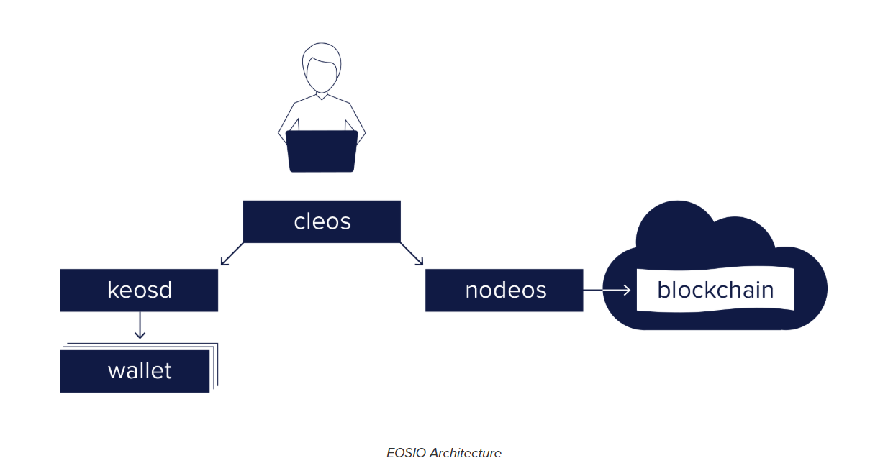

### blockchain Kyoto#08

#### CryptoZombies, EOS, TRUST

##### Chomoku CEO Hideyuki Ogawa 

---    
### 本日のお題
1 CryptoZombie   

2 EOS     
      
3 TRUST    
---   
### 参考ページ
* CryptoZombie    
https://cryptozombies.io/     
* Solidity   
https://solidity.readthedocs.io/en/v0.4.25/index.html     
* EOS     
https://developers.eos.io/      
---

### CryptoZombieどんなものか？    
ゾンビゲームを作りながらSolidityを学ぶ。     
全部コードを入力するわけでない。     
https://cryptozombies.io/en/course/     
      
* Loom networkというethreumのlayer2でDPOSのサイドチェーンを作っているプロジェクトが運営。EOS on Ethreumとか言っているｗ　     
* めちゃスケールできるゲームとかdappを作れる　　　 
* SolidityはJavascriptに似ているらしい（あんまり書いたことないので・・・）     
* 色々知識を得られてよかった。 

---
### どんな知識？？(1)
#### contract内にコードを！     
* コードはcontract内にカプセル化されている。    
* 変数や関数はすべてコントラクトに属する。     
      
+++?code=hello_solidity.sol    

--- 

### どんな知識？？(2)
* 関数はデフォルトでpublic。誰でも呼び出せる。    
* コントラクトが誰でも呼び出せ、攻撃に対して脆弱になる。 => privateにする(コード例：下)         
* internalとexternal     
* internalはprivateと同じだけど、コントラクトを継承したコントラクトからは関数にアクセスできる！     
* publicはコントラクトの内部・外部ともに呼び出せる。externalは外部から呼び出せるのみ。    
+++?code=private_sample.sol      
* private使用例     
+++?code=internal.sol
* internal使用例

---
### どんな知識？？(3)
* 戻り値(returns)、関数の修飾子も関数の後に加える 
* 戻り値(returns): 戻り値の方を書いておく。          
* view修飾子: ブロックチェーンからデータを読み込みのみできる。ブロックチェーン上で何もしない。外部から呼び出される場合ガスなし。関数から呼び出されて使われるとガス必要。     
* pure修飾子: ブロックチェーンから読み込みも書き込みもできない。トランザクションを発生させない。            

+++?code=solidity-pure-view.sol
* 戻り値     
 
---

### どんな知識？？(4)
* 乱数はハッシュ関数(keccak256())を使って発生させる。    
* ブロックチェーンでの安全な乱数の発生は非常に難しい課題。ハッシュ関数を使っての乱数発生は安全なものではないが、ゾンビのDNA生成にはこれで十分。    
* eventは、何かが起こった時にイベントを発生させることができる。     
* 安全な乱数発生に関する議論    
https://ethereum.stackexchange.com/questions/191/how-can-i-securely-generate-a-random-number-in-my-smart-contract      
+++?code=random.sol
* 乱数の発生のさせ方
+++?code=event.sol
* zombiesにpushされたらnewZomieというイベントが発生する。    
---

### どんな知識？？(5)
#### データ型 addressとMappings
* address / 言わずと知れた
* Mappings / データを格納するときに使える方法の一つ。キーバリューストア     
      
#### msg.sender
* 全ての関数で利用できるグローバル変数の一つ。     
参考：Units（お金の単位）とグローバル変数  https://solidity.readthedocs.io/en/v0.4.25/units-and-global-variables.html      

+++?code=mappings.sol
+++?code=msgsender.sol
* これを利用すると、関数を呼び出したユーザーのaddressを参照できる。      
* solidityは外部の呼び出し元から関数を実行するとの決まりがある。関数を呼び出すまでコントラクトはブロックチェーンに何もしない。     

---
### どんな知識？？(6)
#### require 
* 条件が違えばエラーを返す。     
     
#### 変数の格納
* storageとmemoryの二つがある。    
* storageはブロックチェーン上に永久に格納される変数。    
* 多くの場合はsolidityが勝手に判断する。     
* 状態変数はデフォルトでstorageに、関数内変数はmemoryに。     

+++?code=require.sol
* この例だと_nameのところに"Vitalik"と入力されればHiと返す。     

---
### どんな知識？？（７）
#### 別コントラクトとのやり取り
* interfaceを宣言すると、別コントラクトの関数が読み込める。   
     
+++?code=interface.sol
　　　　
---
### どんな知識？？（８）
#### contracts
* contractをethereum上にデプロイすると編集も更新もできなくなる。    
* 修正する方法はなく、別のスマートコントラクトを使うようにユーザーに伝えないといけない。      
* 外部のcontractを使った場合、それが影響した地留守の出、その影響を受けないように作る。    
---

### どんな知識？？（９）
#### ownableコントラクト
* Ownable / 特別な権限を持つオーナーのみアドレスの更新ができるライブラリ。OpenZepplinのライブラリ。     
* onlyOwner / 修飾子。
https://github.com/OpenZeppelin/openzeppelin-solidity/blob/master/contracts/ownership/Ownable.sol
---

### どんな知識？？（10）
#### OpenZepplin / コミュニティの検証を経た安全なスマートコントラクト。Crowdsalesに関しても安全なコードが記載されている。        
https://openzeppelin.org/     
https://openzeppelin.org/api/docs/learn-about-crowdsales.html     

---

### どんな知識？？（11）
#### ガス
* ethereumではファンクションを実行するたびに、ガスと呼ばれる通貨を支払うことになっています。    
* 実行に必要なガス量はそれを実行するためにどのくらいの計算資源が必要かに左右される。     
* 例えばstorageへの操作は高コストなので、
* というわけで無駄のないコードを作り、コストカットを目指すのがsolidityの正しい書き方！     
gas tracker: https://etherscan.io/gastracker     
     
---
### どんな知識？？（12）
#### modifier        
* 修飾子を作る。    

#### payable
* Etherを受け取ることのできる関数     

+++?code=modifier.sol
* modifierで独自の修飾子を作り、関数に渡した。引き数も設定できる。    
+++?code=payable.sol
* msg.value / コントラクトにEtherが送られた金額を見る。     
* 関数にpayable修飾子がなく、Etherをweb3.jsから送ろうとする場合、その関数はトランザクションを拒否する。     
      
---
### どんな知識？？（13）
#### 引き出し関数 transfer
* コントラクトに送られたEtherを引き出す。     

+++?code=withdraw.sol
* this.balanceはコントラクトに存在する残高の総量。     

---

### どんな知識？？（14）
#### トークンについて
* イーサリウム上のトークンは、基本的にいくつかのルールに従ったスマートコントラクトです。     
* トークンは誰がどれくらい所有しているかを記録するコントラクト、ユーザーが自分のトークンを他のアドレスに送ることができる機能が付いている。    
---

### どんな知識？？（15）
#### ERC20トークン   
* 固有の機能がないため、一つのトークンが扱えると、他の同規格のトークンもコントラクトアドレスをデータベースに追加するだけで取り扱える。    
* 誤ってコントラクトアドレスにトークンを送金すると、トークンを動かせなくなり、使えなくなる。    

---

### どんな知識？？（16）
#### コントラクトアドレス 
* 契約内容を実行するアドレス     
* コントラクト　=> ブロックチェーンに書き込み => コントラクトの内容を実行    
     
---

### どんな知識？？（17）
#### ERC223トークン      
* コントラクトに対応していないトークンがコントラクトアドレスに送金された際は、元の送り主に自動的に返金する。ERC20トークンの問題点を解決。    
---

### どんな知識？？（18）
#### ERC721トークン
* ノンファンジブル(代替不可能)トークン。     
* 様々なデータを含むことができる。例えば、クリプトキティ。     
    
* そういえばPEPE CASHとかあったなぁ（遠い目      
     
---

### どんな知識？？（19）
#### ERC721トークンの移動のロジック      
* 2つの異なる移転の方法を持つ。    
    
+++?code=token_transfer.sol     
* 1 トークン所有者が送り先(address)、送りたいトークン(uint256)をtransfer関数を使って送る。     
* 2 approveを使って1と同様のことを行う。誰がトークン受け取りを許可されたのかがmapping (uint => address)にてコントラクトに記録。さらに,
トークンの受け手がtakeOwnership関数を呼び出し。msg.senderが所有者からトークンの受け取りを許可されているか確認し、承認済みの場合は受け手にトークンを送る。     
      
---

### どんな知識？？（20）
#### スマコンのセキュリティ　
##### オーバーフロー
```
uint8 number = 255;
number++;
```
* 255 => 0になる的な・・・     
##### アンダーフロー
```
uint8 number = 0;
number--;
```
* 0 => 255になる的な・・・      
==> OpenZeppelinのライブラリ、SafeMathで解決や！      
---

### どんな知識？？（21）
#### コメント
// 1行コメント、　/* 複数行コメント      
netspec  ///のあとに    
@title 、 @authorはそのままの意味、@noticeはユーザー向け、@devは開発者向けの更なる解説。
　@param、　@return　関数の各＠パラメーターについて記述。    

---

### どんな知識？？（22）
#### web3.js
* ユーザーがDAppとやり取りできるベーシックなウェブページを作る際に使うJavascriptのライブラリ。    
* DAppを運営するのに、自分でノードを運用する必要はなく、サードパーティーの<b>Infura</b>を使うと良い。     
* API経由で利用可能。      
---

### どんな知識？？（23）
* ユーザーが秘密鍵で署名する必要性が・・・　＝＝＞　自分で管理しない。有名なのは<b>Metamask</b>!     
* MetamaskはChromeとFirefoxのブラウザ拡張機能で、ユーザはアカウントと秘密鍵を安全に管理し、そのアカウントをWeb3jsを使っているウェブサイトとやり取りすることが可能。 ==> ブラウザ拡張機能使いたくないなぁ・・・    

---

### web3.js
https://web3js.readthedocs.io/en/1.0/   
### infura   
https://infura.io/     
### metamask
https://metamask.io/    

---

### solidity
https://solidity.readthedocs.io/en/v0.4.25/common-patterns.html    
### openzeppelin 
https://openzeppelin.org/    
### eth gas station
https://ethgasstation.info/index.php    

---

## 2. EOSに関して

* 1年間ICOをして話題になった。    
* 初めはERC20トークンだったが、今は自前のプラットフォーム   
* コンセンサスアルゴリズムはDPOS    
* アプリの運用するとしてもコストかからんし良いかなぁ。   

---

### Getting Startedを途中まで・・
##### 得た知見
* Windowsには今のところ対応していない。    
* WebAssembly(WASM)を使っている。     
＝＞アプリの高速化を目指したもの?よく分からない。     
https://qiita.com/OMOIKANESAN/items/1ffc06ef6283befc4355    
* C++が良いみたい。ほかの言語の対応もサードパーティーが行っている。    
* dockerで環境を作る。    
* CDT(Contract Development Toolkit)をダウンロードするの30分くらいかかる。     

---


https://developers.eos.io/eosio-home/docs/how-it-all-fits-together
---

<b>cleos</b> / ブロックチェーンにつながれ、ウォレットも運用できるコマンドラインツール      
<b>keosd</b> / EOSIOのカギをウォレットに安全に置く。    
<b>nodeos</b> / nodeを動かす     
    
---
### 動かしてみた

* ウォレットは問題なく作れた。    
* でもハローワールドは書いている通りではできなかった。   
* githubにあるハローワールドだとできた。    
https://github.com/EOSIO/eos/blob/master/contracts/hello/hello.cpp    
* しかし、2.2のStep5のCreate Tokenという面白そうなところで進めなくなった。   
https://developers.eos.io/eosio-home/docs/token-contract        
* 環境を壊して何度もやってみようかと思う。    
      
---

## 3. TRUST

* 新聞を読んでたら「TRUST」って本が出ているということを知った(先週土曜日)。     
https://www.nikkei.com/article/DGXKZO36688620Z11C18A0MY5000/　　　　
* レビューシステムやブロックチェーンによって「分散された信頼」が生まれて、世の中が再構築されている様子を分析し、信頼の本質に迫っている本らしい。    
* しかし、読む時間はなかった。    
* でもTEDに著者のレイチェルボッツマンさんのトークがいくつかあった。    
We've stopped trusting institutions and started trusting strangers.
https://www.ted.com/talks/rachel_botsman_we_ve_stopped_trusting_institutions_and_started_trusting_strangers#t-83765     

---
#### 内容
* 信頼の定義
* 19世紀くらいまで信頼はlocalで築かれるものだった。    
* その後、機関、巨大企業が仲介した。     
* 人びとが都市部に集まった。そのため、権威がそれをになった。契約書、規制、保険など。    
* 最近は大企業などの信頼を裏切る事件が多く起こっている。    
* フォルクスワーゲンのガス不正、カトリックの性的虐待、銀行による金融恐慌、金持ちのパナマペーパー。     

---
#### 内容2
* 信頼を裏切っても誠実に謝罪することがない。    
* 機関への信頼はデジタル時代には向かない。      
* 信頼を作る新たな方法の登場。     

---


---
